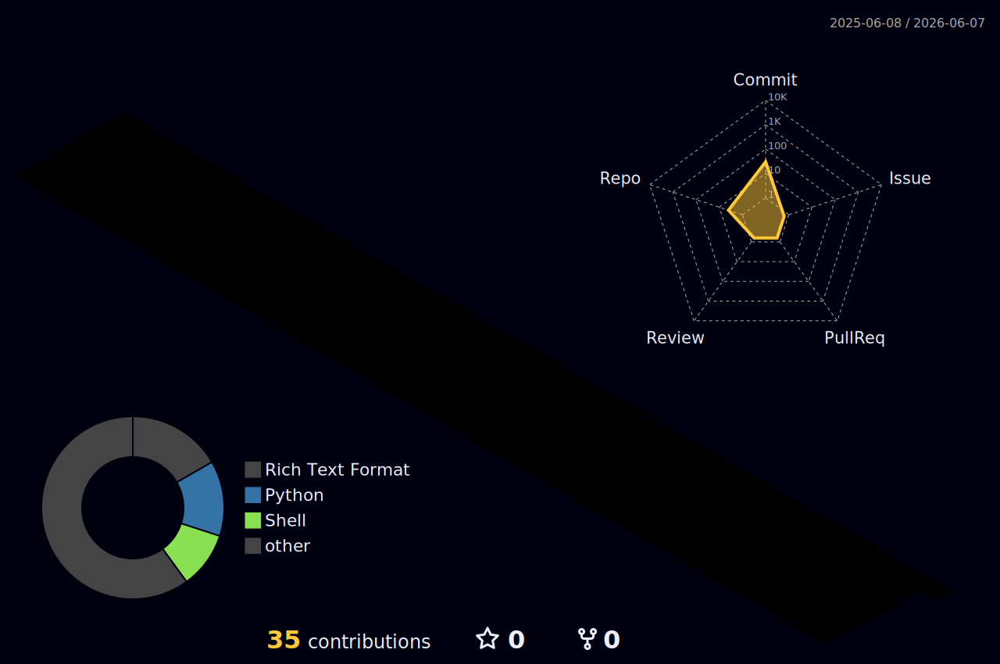

<h1 align="center">Hey  I'm Praveen Raj N</h1>
<h3 align="center">ML ENGINEER </h3>

  

## 📌 About Me
- 🎓 Final-year B.Tech student in Artificial Intelligence & Data Science at Rajalakshmi Institute of Technology, Chennai.
- 🤖 Aspiring Machine Learning Engineer with a passion for Artificial Intelligence and Data Science.
- 🧠 Skilled in Machine Learning, Deep Learning, Natural Language Processing, and Generative AI.
- 💻 Proficient in Python, SQL, TensorFlow, Scikit-learn, Pandas, NumPy, and Git.
- 📊 Experienced in Data Analysis, Feature Engineering, Model Training, and Model Evaluation.
- 🔬 Working on Genotype-Phenotype Prediction using Topological Deep Learning as a final-year project.
- 🎙️ Developed Jarvis, an emotional AI voice assistant with emotion detection capabilities.
- ⚡ Built AI-powered automation workflows using n8n and intelligent agents.
- 📈 Completed the Tata iQ Data Analytics Job Simulation program.
- 🏆 Certified in Python Programming and Prompt Engineering.
- 🌱 Continuously exploring AI Agents, Machine Learning, Deep Learning, and Intelligent Automation.

## 🧠 My Focus Areas
- 🤖 Machine Learning
- 🧠 Deep Learning
- 💬 Natural Language Processing (NLP)
- ✨ Generative AI
- 🤖 AI Agents
- 🎙️ Voice AI Systems
- 📊 Data Analytics
- 🔍 Predictive Modeling
- ⚡ Intelligent Automation
- 🧬 Topological Deep Learning
- 📈 Data Science
- 🚀 End-to-End AI Solutions

## 📊 GitHub Stats & Trophies

  
  

  

  

## 🛠️ Languages & Tools

<h3 align="center">Programming Languages</h3>

  &nbsp;&nbsp;
  

<h3 align="center">Database</h3>

  

<h3 align="center">Tools</h3>

  &nbsp;&nbsp;
  &nbsp;&nbsp;
  

  

## 🔗 Connect with Me

  &nbsp;&nbsp;
  &nbsp;&nbsp;
  &nbsp;&nbsp;
  

  

